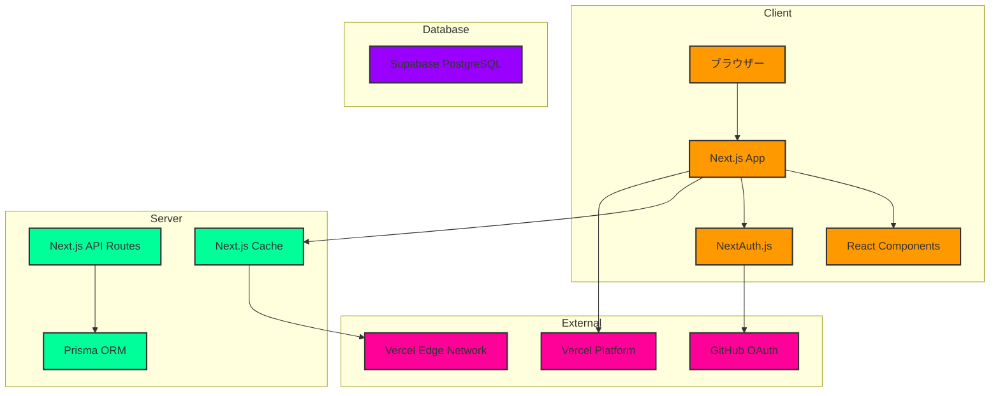

# Pyrrhula - シンプルな分散型マイクロブログ

## TODO

- リプライ
- フォローグラフ
- 個別チャット
- プロフィール設定
- レート
- アイコン
- リアルタイム更新
- レスポンシブ対応
- 個人ページ

## 概要

Pyrrhulaは、シンプルさと使いやすさを重視した分散型マイクロブログプラットフォームです。手軽に情報発信や交流が行えます。

### 開発背景

既存のSNSプラットフォームには以下のような課題があると考えました：

- 過度に複雑化したUI/UX
- プライバシーへの懸念
- アルゴリズムによる情報の偏り

これらの課題を解決するため、以下の特徴を持つプラットフォームを開発しました：

- 直感的で分かりやすいUI
- ユーザーデータの透明性
- アルゴリズムに依存しない時系列タイムライン

### 公開URL

[Pyrrhula](https://pyrrhula.vercel.app)

## 特徴と機能

### 1. シンプルな認証システム

- ユーザーIDとパスワードのみで登録可能
- セキュアなJWT認証
- パスワードの暗号化保存

### 2. 直感的なタイムライン

- 時系列順の表示
- 無限スクロール
- レスポンシブデザイン

### 3. インタラクション機能

- お気に入り登録
- 投稿の拡散（リポスト）
- リプライチェーン

### 4. プロフィール管理

<!-- - アイコン画像のアップロード -->

<!-- - プロフィール情報の編集 -->

- 投稿履歴の確認

### 5. 通知システム

<!-- - リアルタイム通知 -->

- アクション別の通知管理
- 既読/未読の状態管理

## 使用技術

## システム構成図

## 技術スタックの詳細

### フロントエンド

- **Next.js 14**: App Routerを使用したサーバーコンポーネント
- **React 18**: Suspense, Server Componentsサポート
- **TailwindCSS**: スタイリング
- **ShadcnUI**: UIコンポーネント
- **NextAuth.js**: 認証

### バックエンド

- **Next.js API Routes**: RESTful API
- **Prisma**: TypeSafe ORM
- **PostgreSQL**: データベース

### インフラストラクチャ

- **Vercel**: ホスティング & デプロイメント
- **Supabase**: データベースホスティング
- **GitHub Actions**: CI/CD

### 開発ツール

- **TypeScript**: 型安全性
- **ESLint**: コード品質
- **Prettier**: コードフォーマット

## 開発期間・体制

- 開発体制：個人開発
- 開発期間：2025.2 (約30時間)

## 工夫した点

- 意図的に投稿/アカウントの削除/編集機能を付けていません。今まで類似サービスを使ってきた経験からです。
- 意図的にユーザーIDは変更できませんし、決めることもできません。単にログイン機能としてのみ使われます。

## 既知の課題

- 画像アップロード時のパフォーマンス改善
- プッシュ通知の実装
- 検索機能の強化

## リンク

- [2ufkpfbdaxnik](https://github.com/2ufkpfb9daxnik/pyrrhula)
- [ポートフォリオ](https://2ufkpfb9daxnik.github.io/portfolio/page/pyrrhula)
