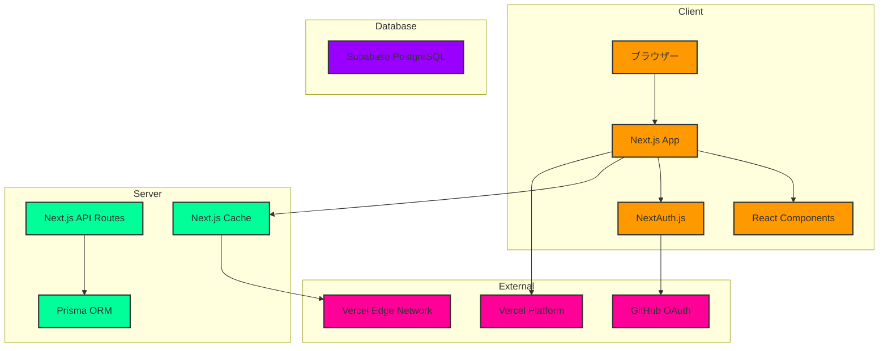

# 鷽(ウソ)

レートのあるSNS

## 概要

鷽は、シンプルさと使いやすさを重視したレートのあるSNSです。手軽に情報発信や交流が行えます。

### 開発背景

既存のSNSプラットフォームには以下のような課題があると考えました：

- 過度に複雑化したUI/UX
- プライバシーへの懸念
- アルゴリズムによる情報の偏り

また、以下のような機能があると面白いと考えました：

- 投稿数に応じたレーティングシステム
  - ユーザーの活動度が一目で分かる
- 全体タイムライン
  - アカウント作成直後から好みの投稿者を見つけやすい
  - アルゴリズムに依存せず多様な投稿に触れられる
- フォローグラフ
  - ユーザー間のつながりを視覚的に把握
  - 好みの投稿者に近いユーザーの発見が容易

これらの課題を解決し、新しい機能を実現するため、以下の特徴を持つプラットフォームを開発しました：

- 直感的で分かりやすいUI
- アルゴリズムに依存しない時系列タイムライン
- レーティング、全体タイムライン、フォローグラフが存在

全体的におすすめアルゴリズムに頼らないで他のユーザーの発見が容易であるような設計を心がけました。

### 公開URL

[鷽](https://pyrrhula.vercel.app)

## 特徴と機能

### 1. シンプルな認証システム

- ユーザーIDとパスワードのみでログイン可能
- セキュアなJWT認証
- パスワードの暗号化保存

### 2. 直感的なタイムライン

- 時系列順の表示
- 無限スクロール
- レスポンシブデザイン

### 3. インタラクション機能

- お気に入り登録
- 投稿の拡散（拡散）
- リプライチェーン

### 4. プロフィール

<!-- - アイコン画像のアップロード -->

- プロフィール情報の編集

- 投稿履歴の確認

### 5. 通知システム

<!-- - リアルタイム通知 -->

- アクション別の通知管理
- 既読/未読の状態管理

## 6. 全体タイムライン

フォローしている人のもしていない人のも全部流れてくるタイムラインがあります

## 7. チャット

それぞれのユーザーたちと自由にチャットできます

グループチャットもあります。

## 8. フォローグラフ

フォロー/フォロワー関係にある人たちをグラフで表します。矢印で指されている人がフォローされている人です。

## 9. レーティング

投稿頻度などによってレーティングがつき、それぞれに対応する色が名前に反映されます

## 10. ハッシュタグ

ハッシュタグを付けるとそのワードで簡単に検索できます

## 11. 質問

匿名質問機能があります

## 12. レスポンシブ対応

これらの全ての機能について、スマートフォンなどで見たときに表示が適したものになるようになっています

## 使用技術

## システム構成図

## 技術スタックの詳細

### フロントエンド

- **Next.js 14**: App Routerを使用したサーバーコンポーネント
- **React 18**: Suspense, Server Componentsサポート
- **TailwindCSS**: スタイリング
- **ShadcnUI**: UIコンポーネント
- **NextAuth.js**: 認証
- **VisJS**:フォローグラフの描画

#### Reactライブラリ

- **Zustand**: 軽量な状態管理
- **SWR**: データフェッチとキャッシュ(チャットの送信、投稿、お気に入りなどについて楽観的更新)
- **Lucide React**: アイコンコンポーネント
- **Radix UI**: アクセシブルなヘッドレスUIコンポーネント
- **Vis.js**: フォローグラフの可視化
- **Recharts**: データの可視化
- **React Flow**: フローチャートとグラフ
- **date-fns**: 日付操作
- **react-swipeable**: フォロー中タイムライン/全体タイムラインと、プロフィール/ユーザー一覧ページの切り替え

### バックエンド

- **Next.js API Routes**: RESTful API
- **Prisma**: 型安全ORM
- **PostgreSQL**: データベース

### インフラストラクチャ

- **Vercel**: ホスティング & デプロイ
- **Supabase**: データベースホスティング
- **GitHub Actions**: CI/CD

### 開発ツール

- **GitHub Copilot**: Claude3.5および3.7 sonnetを全体で使用
- **TypeScript**: 型安全性
- **ESLint**: コード品質
- **Prettier**: コードフォーマット

## 開発期間・体制

- 開発体制：個人開発
- 開発期間：2025.2 (約50時間)

## 工夫した点

- 意図的に投稿/アカウントの削除/編集機能を付けていません。今まで類似サービスを使ってきた経験からです。
- 意図的にユーザーIDは変更できませんし、決めることもできません。単にログイン機能としてのみ使われます。
- パスワードに漢字や平仮名を使うことができます。これでラテン文字だけとは比べ物にならない強固なパスワードを少ない文字数で作ることができます。

## 既知の課題

- プッシュ通知の実装
- 検索機能の強化

## 各種リンク

- [2ufkpfbdaxnik](https://github.com/2ufkpfb9daxnik/pyrrhula)
- [もう少しフランクな開発動機など](https://2ufkpfb9daxnik.github.io/portfolio/page/pyrrhula)
