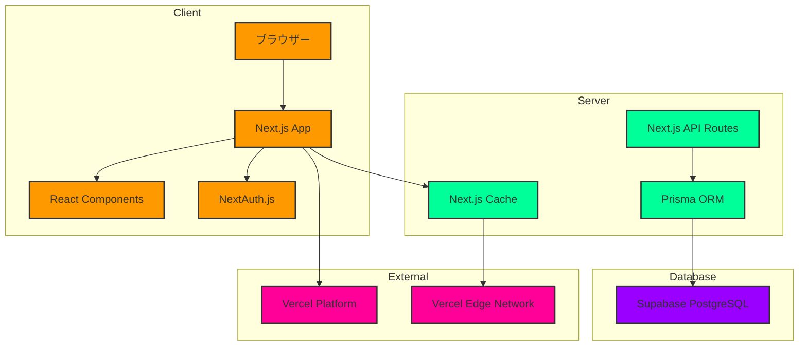

# 鷽

## 概要

以下のような機能があると面白いと考えました

- レート
- 全体タイムライン
- アルゴリズムに依存せず多様な投稿に触れられる
- フォローグラフ
  - ユーザー間のつながりを視覚的に把握
  - 好みの投稿者に近いユーザーの発見が容易

### 公開URL

[鷽](https://pyrrhula.vercel.app)

## 特徴と機能

### シンプルな認証システム

- ユーザーIDとパスワードのみでログイン可能
- 安全なJWT認証
- パスワードの暗号化保存

### 直感的なタイムライン

- 時系列順の表示
- 無限スクロール
- レスポンシブデザイン

### インタラクション機能

- お気に入り登録
- 投稿の拡散

### プロフィール

- プロフィール情報の編集
- 投稿履歴の確認

### 通知システム

- アクション別の通知管理
- 既読/未読の状態管理

## 全体タイムライン

フォローしている人のもしていない人のも全部流れてくるタイムラインがあります

## チャット

※ この機能は閉鎖しています

それぞれのユーザーたちと自由にチャットできます

グループチャットもあります。

## フォローグラフ

フォロー/フォロワー関係にある人たちをグラフで表します。矢印で指されている人がフォローされている人です。

## レーティング

投稿頻度などによってレートがつき、それぞれに対応する色が名前に反映されます

## ハッシュタグ

ハッシュタグを付けるとそのワードで検索できます

## 質問

質問機能があります

## 使用技術

| 区分           | 技術                                                      |
| -------------- | --------------------------------------------------------- |
| フロントエンド | Next.js 16, React 18, TypeScript, Tailwind CSS, shadcn/ui |
| データ取得     | TanStack React Query（localStorage 永続化）               |
| 認証           | NextAuth.js（Credentials / JWT）                          |
| バックエンド   | Next.js API Routes, Prisma                                |
| データベース   | PostgreSQL（Supabase）                                    |
| リアルタイム   | Supabase Realtime                                         |
| デプロイ       | Vercel                                                    |

## システム構成図

```mermaid
graph TB
    subgraph Client
        Browser[ブラウザー]
        NextJS[Next.js App]
        React[React Components]
        Auth[NextAuth.js]
    end

    subgraph Server
        API[Next.js API Routes]
        Prisma[Prisma ORM]
        Cache[Next.js Cache]
    end

    subgraph Database
        Supabase[Supabase PostgreSQL]
    end

    subgraph External
        Vercel[Vercel Platform]
        CDN[Vercel Edge Network]
    end

    Browser --> NextJS
    NextJS --> React
    NextJS --> Auth
    API --> Prisma
    Prisma --> Supabase
    NextJS --> Cache
    Cache --> CDN
    NextJS --> Vercel

    classDef primary fill:#ff9900,stroke:#333,stroke-width:2px;
    classDef secondary fill:#00ff99,stroke:#333,stroke-width:2px;
    classDef database fill:#9900ff,stroke:#333,stroke-width:2px;
    classDef external fill:#ff0099,stroke:#333,stroke-width:2px;

    class Browser,NextJS,React,Auth primary;
    class API,Prisma,Cache secondary;
    class Supabase database;
    class Vercel,CDN external;
```

## 技術スタックの詳細

### フロントエンド

#### コア

- **Next.js 16（App Router）**: ページルーティング、Server / Client Components、API Routes をひとつのプロジェクトで運用
- **React 18**: UI 構築。タイムライン、プロフィール、検索など主要画面は Client Component 中心
- **TypeScript 5**: 型安全な開発

#### UI / スタイル

- **Tailwind CSS**: レイアウト・配色・レスポンシブ対応
- **shadcn/ui**: Button、Dialog、Tabs などの UI コンポーネント群
- **Radix UI**: shadcn/ui のベースとなるアクセシブルなプリミティブ
- **Lucide React**: アイコン
- **sonner**: トースト通知（投稿・フォロー・設定変更など）

#### データ取得・状態管理

- **TanStack React Query v5**: メインのデータ取得レイヤー
  - タイムライン（無限スクロール）、ユーザー情報、検索、リスト、通知など
  - `@tanstack/react-query-persist-client` により **localStorage へキャッシュ永続化**（再訪問時に即時表示）
- **Zustand**: レーティング表示用の軽量ストア（`ratingStore`）
- **SWR**: グループチャット周りなど、一部レガシー用途で併用

#### リアルタイム

- **Supabase Realtime**（`@supabase/supabase-js`）: タイムライン・通知の差分更新

#### 可視化・操作補助

- **vis-network / vis-data**: フォローグラフの描画
- **Recharts**: プロフィールのレート履歴グラフ
- **react-swipeable**: タイムライン切替やプロフィール／ユーザー一覧のスワイプ操作
- **react-intersection-observer**: 無限スクロールの読み込みトリガー
- **date-fns**: 日時の表示フォーマット
- **KaTeX**: 投稿本文の数式レンダリング
- **react-hook-form + Zod**: リスト作成などフォームのバリデーション

### バックエンド

- **Next.js API Routes**: REST 風 API（投稿、フォロー、通知、ユーザー、リスト、管理画面など）
- **NextAuth.js v4**: ユーザー ID / パスワードによる Credentials 認証、JWT セッション
- **bcrypt**: パスワードのハッシュ化・照合
- **Prisma 6**: PostgreSQL 向け ORM。スキーマ管理・型安全なクエリ
- **PostgreSQL**: ユーザー、投稿、フォロー、通知、レート履歴などを保存
- **Vercel Cron**: アカウント経過日数に応じたレート更新（`/api/cron/update-account-age-rating`）

### インフラストラクチャ

- **Vercel**: 本番ホスティング・デプロイ
- **Supabase**: PostgreSQL のホスティング、Realtime 利用
- **GitHub Actions**: Supabase のスリープ防止のための定期 ping（`dasily-ping.yaml`）

### 開発・品質

- **TypeScript**: アプリ全体の型チェック
- **ESLint 9**（flat config）: 静的解析（React / Next.js / a11y / Tailwind ルール）
- **Prettier**: コードフォーマット
- **Vitest**: ユニットテスト（例: `src/lib/rating.test.ts`）
- **Prisma Migrate / `prisma generate`**: DB スキーマ同期とクライアント生成

## 工夫した点

- 思想あってリプライとチャットを閉鎖しました エアリプだけが本質なので
- 意図的に投稿/アカウントの削除/編集機能を付けていません。
- 意図的にユーザーIDは変更できませんし、決めることもできません。単にログイン機能としてのみ使われます。
- パスワードに漢字や平仮名を使うことができます。これでラテン文字だけと比べて強固なパスワードを少ない文字数で作ることができます。

- [跋](https://2ufkpfb9daxnik.github.io/portfolio/pages/pyrrhula)
